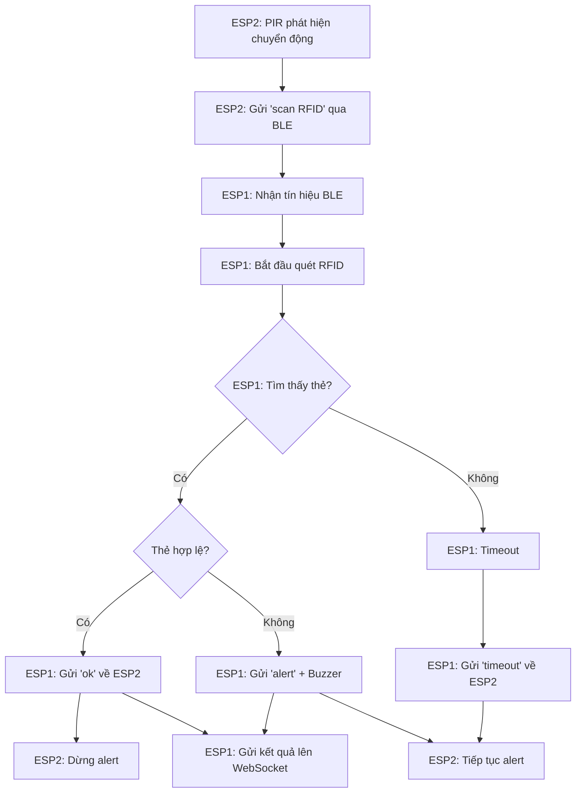

# Hệ Thống BLE RFID với ESP32

## 📋 Mô Tả
Hệ thống gồm 2 thiết bị ESP32 hoạt động qua BLE:
- **ESP2 (Peripheral)**: Phát hiện chuyển động và gửi tín hiệu BLE
- **ESP1 (Central)**: Nhận tín hiệu, quét RFID và gửi phản hồi

## 📁 Cấu Trúc Files

```
arduino/
├── ESP2_Peripheral.ino      # Code cho ESP2 (Peripheral)
├── ESP1_Central.ino         # Code cho ESP1 (Central)  
├── config.h                 # File cấu hình chung
├── test_integration.ino     # File test tích hợp
├── BLE_RFID_SYSTEM_GUIDE.md # Hướng dẫn chi tiết
└── README_BLE_RFID.md       # File này
```

## 🚀 Cài Đặt Nhanh

### 1. Chuẩn Bị Phần Cứng
- 2 x ESP32 development board
- 1 x PIR sensor (HC-SR501)
- 1 x RFID reader (RS485)
- 1 x Buzzer
- Dây nối và breadboard

### 2. Kết Nối Phần Cứng

#### ESP2 (Peripheral)
```
PIR Sensor VCC -> 3.3V
PIR Sensor GND -> GND  
PIR Sensor OUT -> GPIO 15
```

#### ESP1 (Central)
```
RFID Reader VCC -> 5V
RFID Reader GND -> GND
RFID Reader TX  -> GPIO 16 (RXD2)
RFID Reader RX  -> GPIO 17 (TXD2)

Buzzer (+) -> GPIO 18
Buzzer (-) -> GND
```

### 3. Upload Code
1. Mở `ESP2_Peripheral.ino` → Upload vào ESP2
2. Mở `ESP1_Central.ino` → Upload vào ESP1
3. Mở Serial Monitor để theo dõi

## ⚙️ Cấu Hình

### WiFi (ESP1)
```cpp
#define WIFI_SSID "Your_WiFi_Name"
#define WIFI_PASSWORD "Your_WiFi_Password"
#define SOCKET_SERVER "192.168.1.100"
#define SOCKET_PORT 3001
```

### Thẻ RFID Hợp Lệ
```cpp
const String VALID_RFID_TAGS[] = {
  "E20000123456789012345678",
  "E20000123456789012345679",
  "E20000123456789012345680"
};
```

## 🔄 Luồng Hoạt Động



## 📊 Monitoring

### Serial Monitor Output
```
ESP2:
🔵 ESP1 đã kết nối!
🚨 Bắt đầu alert - Phát hiện chuyển động!
📤 Gửi tín hiệu: scan RFID
✅ RFID hợp lệ - Dừng alert

ESP1:
🎯 Tìm thấy ESP2_Peripheral!
🔗 Đã kết nối tới ESP2!
📥 Nhận từ ESP2: scan RFID
🔍 Bắt đầu quét RFID...
🏷️ Tìm thấy thẻ: E20000123456789012345678
✅ Thẻ hợp lệ: E20000123456789012345678
📤 Gửi phản hồi tới ESP2: ok
```

## 🧪 Testing

Chạy file `test_integration.ino` để test các chức năng:
- PIR sensor
- RFID reader  
- BLE connection
- WiFi connection
- WebSocket connection

## 🔧 Troubleshooting

| Vấn đề | Nguyên nhân | Giải pháp |
|--------|-------------|-----------|
| ESP1 không tìm thấy ESP2 | ESP2 chưa advertising | Kiểm tra code ESP2, reset ESP2 |
| RFID không đọc được thẻ | Kết nối sai RX/TX | Kiểm tra dây nối GPIO 16,17 |
| PIR không phát hiện | Sensor chưa warm-up | Đợi 1-2 phút sau khi bật |
| WebSocket lỗi kết nối | WiFi hoặc server | Kiểm tra WiFi, IP server |

## 📈 Tối Ưu Hóa

### Tăng tốc độ phản hồi
```cpp
#define NOTIFY_INTERVAL 500    // Giảm từ 1000ms xuống 500ms
#define SCAN_TIMEOUT 3000      // Giảm từ 5000ms xuống 3000ms
```

### Tiết kiệm pin
```cpp
#define ALERT_DURATION 10000   // Giảm từ 20000ms xuống 10000ms
```

## 📚 Tài Liệu Tham Khảo

- [ESP32 BLE Documentation](https://docs.espressif.com/projects/esp-idf/en/latest/esp32/api-reference/bluetooth/esp32.html)
- [ArduinoJson Library](https://arduinojson.org/)
- [Socket.IO Client](https://github.com/LiamBindle/SocketIO-Client)

## 👥 Đóng Góp

1. Fork repository
2. Tạo feature branch
3. Commit changes
4. Push to branch  
5. Tạo Pull Request

## 📄 License

MIT License - Xem file LICENSE để biết thêm chi tiết.

---

**Lưu ý**: Đảm bảo test kỹ trước khi triển khai trong môi trường production.
